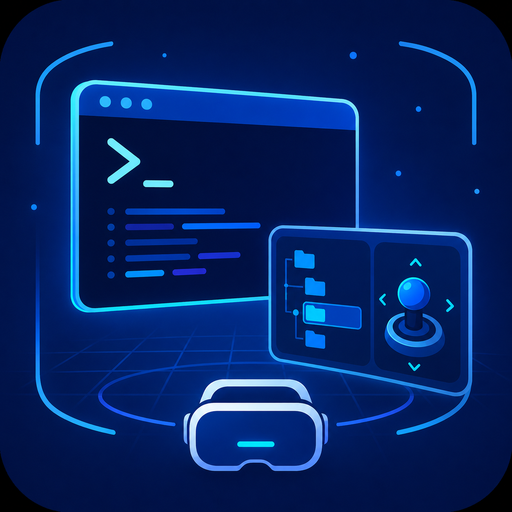

# linux-terminal

A terminal for Linux that lives in a VR headset. A **server** you install on any
machine you own, a **client** in the Quest that connects to it, and a control bar
you can drive with your voice.

## What it is for

Coding agents changed what a terminal session is. With Claude Code, Codex or
anything like them in front of you, most of the time you are not typing code —
you are reading what the agent did and saying what to do next. That is
supervision, and supervision does not need a desk.

So the terminal moves. The server runs wherever the code is: the machine under
the desk, a box in a datacentre, a VPS you keep for exactly this. The headset
connects to whichever one you pick and gives you as many terminal windows as you
want, at any size, from the sofa. You speak, the text lands at the cursor, the
agent works, and the buttons in front of you change to whatever that agent needs
right now.

That is the whole idea: **vibe-coding from the couch**, with a real shell on a
real machine at the other end.

Two consequences worth stating plainly. It is a **client-server** product, not a
companion to one particular desktop — several machines, listed side by side,
each a press away. And it sends **text**, not video: a terminal over a phone
tether or from another city works the same as one on the LAN.

## Why not simply stream the desktop

You can, and the [other repository](https://github.com/butschster/linux-vr) does
exactly that. But for a terminal it is a strange thing to do: the shell produces
text, and rasterising it, compressing it with H.264, sending it and scaling it
back can only make that text worse. Here the bytes are sent as bytes and the
headset draws the glyphs itself, at the panel's own resolution.

| | Streamed desktop | This |
|---|---|---|
| Text sharpness | limited by encode, scale and optics | limited by optics alone |
| Bandwidth | ~2 Mbit/s idle, tens under motion | bytes per keystroke |
| Latency | capture + encode + network + decode | network only |
| Over a tether, or from another city | no | yes |
| A browser, a video, a GUI | yes | no — that is what the other one is for |

## What is actually interesting here

**The bar follows what is running.** At a shell prompt it offers the directory
above, the directories inside, and the projects you open most often. Start `vim`
and it becomes `:w`, `:q!`, `/`. Start Claude Code and it becomes mode cycling,
`1`/`2`/`3` for its permission prompts, `/compact`, and one button per skill in
that project.

**That is read, not guessed.** A pty has a foreground process group, so the
server asks the kernel which program is in front and reads `/proc` for the rest.
No window titles, no watching for prompts. It matters because a bar that guesses
wrong is worse than a fixed one: keys that move at the moment you reach for them
are a hazard, not a convenience.

**The keys that must always be there never move.** Escape, `^C`, `^D`, Tab,
backspace, `^W`, `^U`, the arrows and Enter live on a fixed half, built once and
never rebuilt. The Quest's own keyboard has none of them; without them a
terminal cannot be used at all.

**Dictation goes straight into the pty**, and the **server** does the
recognition. The headset records; this machine transcribes and hands the text
back over the connection that already exists. A key shipped to a headset is a
key on a device you carry into other people's houses; on the server it sits in a
file only your account can read. Point it at OpenAI with a key, or at a Whisper
you run yourself — the difference is a URL. See [`docs/voice.md`](docs/voice.md).

**It can put an icon in the tray** on a machine you sit at — `--tray` — showing
how many headsets are connected and what each is doing, with a click through to
the console. Experimental and off by default: an earlier version refreshed its
menu on a timer, which GNOME answers by re-reading the whole menu, and that
froze the desktop. The refresh is edge-triggered now, but the default stays off
until it has run for a while without incident.

**The server has a small web console.** It runs otherwise invisibly as a user
service, and "is anyone connected, and where does dictation go" should not
require reading a log over ssh. On `http://localhost:9104`: live sessions with
their directory and foreground program, a button to disconnect one, and the
transcription settings. Localhost-only — it has no authentication, so reach it
from elsewhere with `ssh -L 9104:localhost:9104`.

## Install the server

```sh
git clone https://github.com/vr-meta/linux-terminal
cd linux-terminal
./install.sh
```

That builds a static Go binary, installs it to `/usr/local/bin`, and starts it
as a **systemd user service** — a user service on purpose: the shells it opens
are yours, and they inherit your environment, your PATH and your `~/.bashrc`.

Go is the only requirement. `PREFIX=~/.local ./install.sh` avoids `sudo`
entirely; `./install.sh --no-service` just leaves you the binary.

```sh
make server          # server/linux-terminal-server
make install         # binary + service
make run             # in this terminal, no service
```

Install it on every machine you want to reach. They all announce themselves the
same way.

## Install the client

```sh
make apk             # builds and installs on the attached headset
```

Or by hand:

```sh
cd client && ./gradlew :app:assembleDebug
adb install -r app/build/outputs/apk/debug/app-debug.apk
```

Needs JDK 21 and Android SDK 34; put `sdk.dir=` in `client/local.properties`.
Sideloaded apps live under **Unknown Sources** in the Quest's app library.

## Using it

Open **linux terminal**. Machines on the same network appear by themselves — the
server answers a UDP probe on port 9103. A machine somewhere else is typed in
once by address and remembered.

Pick one and you get a terminal window with tabs, and a bar window beside it.
Both are ordinary Horizon OS windows: the shell places them, resizes them, and
lets them sit next to a browser or anything else.

| | |
|---|---|
| new tab, in the current directory | `+` on the tab strip |
| close a tab | `×` on the tab itself |
| bring the bar back | `bar` on the tab strip |
| another machine | pick another server; it opens its own window |
| text size | `A−` / `A+` on the bar |
| the on-screen keyboard | the keyboard button |
| dictation | the microphone button |
| who is connected, where voice goes | `http://localhost:9104` on the server |

## How it is put together

```
Linux                                        Quest 3
┌───────────────────────────┐                ┌──────────────────────────┐
│ linux-terminal-server     │                │ ServersActivity          │
│   ├─ pty ── bash ── claude│◄──── TCP ─────►│ TermActivity  (tabs)     │
│   ├─ tcgetpgrp → /proc    │  framed msgs   │ BarActivity   (buttons)  │
│   ├─ builds the buttons   │◄──── UDP ──────┤ Discovery                │
│   └─ transcribes speech   │◄──── PCM ──────┤ Dictation                │
├───────────────────────────┤     text ─────►└──────────────────────────┘
│ web console :9104         │
└───────────────────────────┘
```

The buttons are computed on the **server**, not in the app. The server is the
side that knows what is running and what is installed, so teaching the bar a new
tool is an edit to one Go table and never a new APK.

Protocol, layout and the reasoning behind both:
[`docs/terminal-app.md`](docs/terminal-app.md).

## Text size

Readability in a headset is governed by the **angular size of a glyph**, not by
pixel density. Measured on this hardware, comfort begins at about **0.39° per
glyph** — the derivation is in [`docs/readability.md`](docs/readability.md), and
the client's defaults come from it.

## Where this came from

It grew out of [linux-vr](https://github.com/butschster/linux-vr), a VR desktop
that streams Ubuntu into the headset as video. The terminal turned out to be a
different product with a different shape — a client and a server, not a screen —
so it lives here. The streamed desktop stays there, and the two are good at
different things.

## Licence

MIT, except `client/app/src/main/java/com/termux/`, vendored from
[termux/termux-app](https://github.com/termux/termux-app) under Apache 2.0. See
[`client/app/NOTICE.md`](client/app/NOTICE.md) for what was changed and why.
